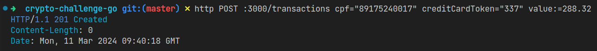

# Crypto Challenge

Resolução desenvolvida por mim, para o desafio de criptografia proposto [neste repositório](https://github.com/backend-br/desafios/blob/master/cryptography/PROBLEM.md).

As tecnologias utilizadas e o critério de escolha das mesmas foram os seguintes:

- Go: estou migrando do Java com SpringBoot para essa tecnologia que apresenta um ecosistema muito interessante para desenvolvimento de web services, além disso grandes *players*, como por exemplo a Uber, fazem grandes contribuições open source, fomentando o amadurecimento do ecosistema da linguagem.

- MySQL: banco de dados bem estabelecido no mercado e mais apropriado para projetos simples como este. Talvez se o projeto fosse mais complexo, o PostgreSQL seria escolhido.

- Criptografia Simétrica utilizando AES-256-GCM: equanto que na criptografia **assimétrica** você precisa de um par de chaves para realizar as operações de criptografia e descriptografia, na criptografia utilizada você precisa apenas de uma chave, essa que será utilizada para criptografar e descriptografar. A escolha foi feita devido ao fluxo de criptografia e descriptografia dos dados, o mesmo ponto (*backend*) que criptografaria também descriptografaria os dados, logo não faria sentido aumentar a complexidade utilizando uma criptografia assimétrica, por exemplo.

## Foto dos resultados

- Requisição de criação de uma transação

    

- Requisição de listagem de transações:

    

- Dados criptografados no banco de dados:

    

## Executar localmente

1. Clone o projeto:

```bash
  git clone https://github.com/marcelsby/crypto-challenge-go.git
```

2. Entre no diretório:

```bash
  cd crypto-challenge-go
```

3. Instale as dependências:

```bash
  go mod download
```

4. Inicie o banco de dados:

```bash
  docker compose up -d mysql
```

5. Copie o arquivo das variáveis de ambiente e preencha (para preencher consulte a seção abaixo):

```bash
  cp .env.example .env
```

6. Execute a aplicação:

```bash
  go run main.go
```

## Preenchimento das variáveis de ambiente

| Variável                  | Descrição                                                    | Exemplo          |
| :------------------------ | :----------------------------------------------------------- | :--------------- |
| `DATABASE_USER`           | Usuário para se conectar ao banco de dados.                  | `CryptoApp`      |
| `DATABASE_PASSWORD`       | Senha do usuário do banco de dados.                          | `PyjzGkmqXdC2`   |
| `DATABASE_NAME`           | Nome do banco de dados para se conectar.                     | `bank`           |
| `CRYPTOGRAPHY_SECRET_KEY` | Chave de criptografia, deve ser uma hex-string com 32 bytes* | `0e18cb28a2...`* |

\* Nos sistemas operacionais UNIX-like você pode gerar uma com o seguinte comando: `openssl rand -hex 32`.